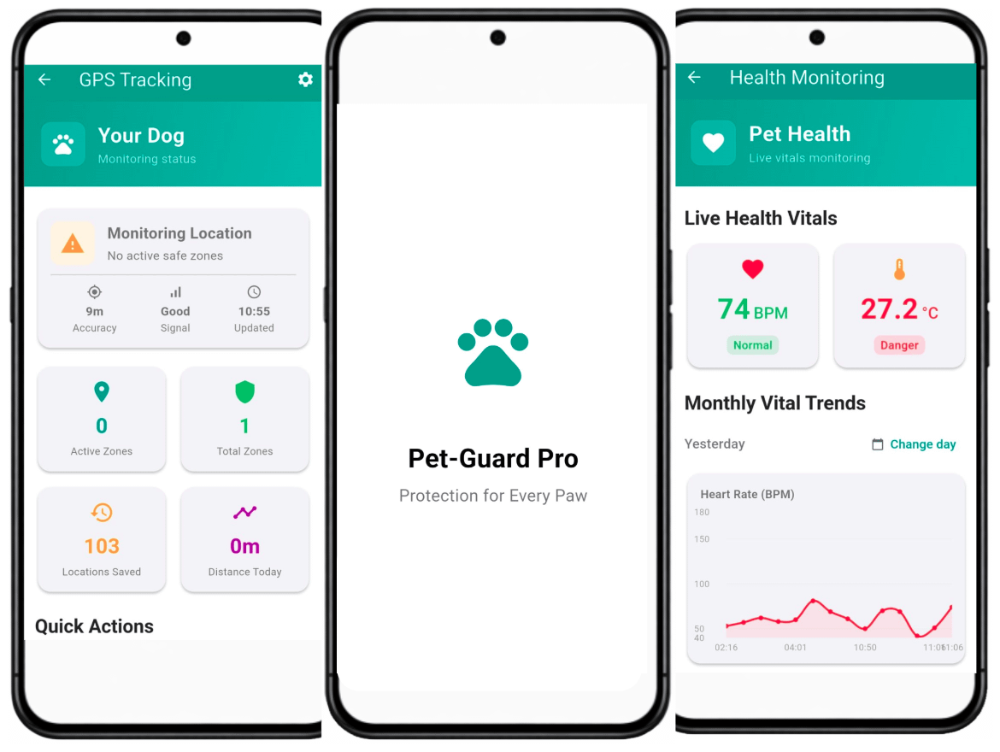
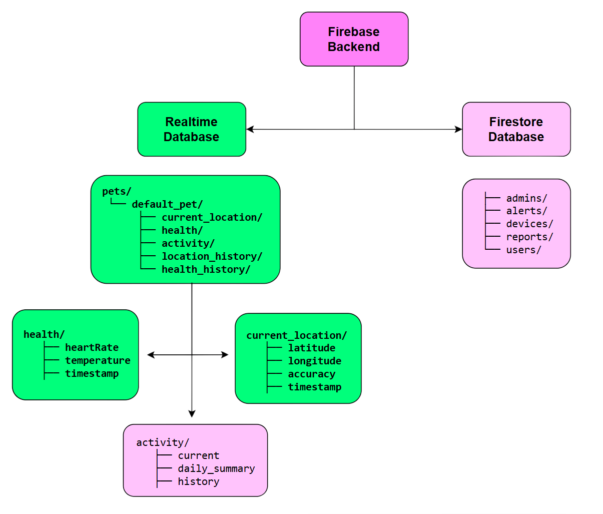

# PetGuard Pro  
**Smart Pet Collar for Real-Time Tracking, Geo-fencing & Health Monitoring**

---

## Team
- **E/21/106** – Bingusari Dissanayaka  
- **E/21/137** – Chandur Fernando  
- **E/21/350** – Prashan Samarawickrama  
- **E/21/428** – Savin Weerasooriya  

<!-- Image of the final hardware / system architecture should be added here -->
<!-- Example:  -->

---

#### Table of Contents
1. [Introduction](#introduction)
2. [Solution Architecture](#solution-architecture)
3. [Hardware & Software Designs](#hardware--software-designs)
4. [Testing](#testing)
5. [Detailed Budget](#detailed-budget)
6. [Conclusion](#conclusion)
7. [Links](#links)

---

## Introduction

Pet owners face significant challenges in ensuring the safety and health of their pets due to limited real-time visibility and delayed responses to emergencies. Pets cannot communicate distress or abnormal conditions, making early detection difficult.

**PetGuard Pro** addresses this problem through an IoT-based smart pet collar integrated with a cloud backend and a mobile application. The system provides real-time location tracking, geo-fencing alerts, health monitoring, and intelligent notifications, enabling proactive and reliable pet care.

---

## Solution Architecture

PetGuard Pro follows a **device–cloud–mobile architecture**:

- **Smart Pet Collar (Edge Device)**  
  Collects location, physiological, and motion data using onboard sensors.

- **Cloud Backend (Firebase - Prototype)**  
  Handles real-time data streaming, storage, and synchronization across devices.

- **Mobile Application (Flutter)**  
  Provides real-time visualization, alerts, and user interaction.

### Communication Flow

1. Sensors → ESP32 (data acquisition)  
2. ESP32 → Firebase (via HTTPS REST APIs over WiFi)  
3. Firebase → Mobile App (real-time streaming)  
4. Mobile App → User interface updates & alerts  

- Communication uses **HTTPS (REST)** instead of MQTT for simplicity and native Firebase compatibility.
- Data is transmitted in **JSON format** with periodic updates (~10 seconds).

---

## Hardware & Software Designs

### Hardware Design (Pet Collar Unit)

- **Microcontroller:** ESP32-WROOM-32  
- **Positioning:** NEO-M8N GPS  
- **Connectivity:** WiFi (prototype), optional cellular for production  
- **Sensors:**
  - **Temperature:** MLX90614 (non-contact IR surface measurement)  
  - **Heart Rate & SpO₂:** MAX30102 (PPG-based sensing)  
  - **Motion Tracking:** MPU6050 (accelerometer + gyroscope)  

- **Power System:**  
  - 3.7V Li-Po Battery  
  - Charging + voltage regulation circuitry  

---

### Software Design

#### Mobile Application

- **Framework:** Flutter (cross-platform, single codebase)

##### Core Features
- Real-time GPS tracking with map visualization  
- Geo-fencing with boundary breach detection  
- Health monitoring (heart rate, estimated body temperature)  
- Activity recognition (resting, walking, active states)  
- Smart alert notifications and history logs  

##### Data Visualization & UX
- Interactive charts for health trends  
- Google Maps integration with route history (polylines)  
- Responsive UI using Material Design principles  

##### Performance Optimization
- **State Management:** Riverpod  
- **Selective UI Rebuilds** for efficiency  
- **GPS filtering** using distance thresholds  
- **Local caching (Hive)** for offline support and reduced latency  

---

#### Cloud Backend (Prototype Implementation)

- **Platform:** Firebase  

##### Services Used:
- **Realtime Database:** Live sensor data streaming  
- **Cloud Firestore:** Structured storage (users, pets, logs)  
- **Firebase Authentication:** Secure user access  
- **Cloud Functions (optional):** Event-based processing  

##### Key Features:
- Real-time synchronization between device and app  
- Scalable NoSQL data structure (per-pet organization)  
- Efficient separation of live vs historical data  
- Offline persistence support  

---

### System Limitations & Workarounds

- **GPS inaccuracy (indoors / dense areas)**  
  → Uses filtered updates and last-known location fallback  

- **PPG signal noise (motion artifacts)**  
  → Moving average filtering and stability checks  

- **Surface temperature vs core body temperature**  
  → Offset-based calibration to estimate internal temperature  
  → Used for trend monitoring rather than medical accuracy  

- **WiFi instability (ESP32)**  
  → Local buffering and retry mechanism for reliable transmission  

---

## Testing

Testing was conducted using a **layered, progressive validation strategy**, ensuring reliability at each stage of system development—from individual components to full system integration.

---

### Testing Strategy & Validation Approach

#### API-Level Testing
Initial validation focused on backend APIs using Postman.

- Verified correct responses for all endpoints  
- Ensured consistency of JSON data structures  
- Validated error handling and edge-case behavior  

---

#### Firebase Integration Testing
The system was then integrated with Firebase to validate real-time data handling.

- Manual database updates were performed  
- Verified instant synchronization with the mobile application  
- Confirmed stability and accuracy of real-time data streaming  

---

#### Hardware Data Simulation (Pre-Hardware Phase)
Before hardware availability, sensor data was simulated using an MQTT-based approach (HiveMQTT).

- Emulated continuous sensor data streams  
- Validated end-to-end flow: **device → cloud → mobile app**  
- Ensured system behavior under real-time update conditions  

---

#### Hardware Integration & Functional Testing
After assembling the hardware, full system testing was conducted using WiFi-based communication.

- Verified sensor readings:
  - Heart rate (MAX30102)  
  - Temperature (MLX90614)  
  - Activity (MPU6050)  

- Confirmed real-time data updates in the mobile application  
- Evaluated system responsiveness during continuous operation  

**Scenario-based validation included:**
- Motion simulation for activity detection  
- Body contact for heart rate measurement  
- Environmental variation for temperature sensing  

---

#### Communication & Reliability Testing
- Tested data transmission stability over WiFi  
- Validated retry mechanisms under intermittent connectivity  
- Measured real-time update latency and consistency  

---

#### Application Testing
- UI responsiveness and performance validation  
- State management behavior using Riverpod  
- Firebase integration and real-time updates  
- Notification triggering and alert accuracy  

---

#### Field Testing
- GPS accuracy in indoor and outdoor environments  
- Geo-fence boundary detection and alert triggering  
- System behavior under real-world usage conditions  

---

#### Future Testing Plan (Scalability & Network Robustness)

Large-scale testing has not yet been conducted due to the use of Firebase for rapid prototyping.

Planned future work includes:

- Migration to AWS-based scalable infrastructure  
- Load testing with multiple devices and users  
- Performance evaluation under high data throughput  
- Integration of cellular (GSM) communication  
- Validation under real network constraints  

---

## Detailed Budget

| Item                              | Quantity | Unit Cost (LKR) | Total (LKR) |
|----------------------------------|:--------:|:---------------:|------------:|
| ESP32 MCU                        | 1        | 1500            | 1500        |
| GPS Module (NEO-M8N)             | 1        | 3000            | 3000        |
| Health Sensors (PPG, IMU, Temp)  | 1 set    | 3300            | 3300        |
| Battery & Charging Circuit       | 1        | 2200            | 2200        |
| Buck Converter                   | 1        | 1000            | 1000        |
| LEDs & Buzzer                    | 1 set    | 150             | 150         |
| PCB, Wiring & Connectors         | 1 set    | 1000            | 1000        |
| Enclosure                        | 1        | 800             | 800         |
| **Total**                        |          |                 | **12,950**  |

---

## Conclusion

PetGuard Pro demonstrates a scalable and efficient IoT-based smart pet monitoring system. By integrating embedded sensing, cloud-based data processing, and a responsive mobile application, the system enables real-time safety monitoring and health insights.

The architecture is designed for extensibility, allowing future enhancements such as cellular connectivity, advanced analytics, and improved power optimization for real-world deployment.

---

## Links

- [Project Repository](https://github.com/cepdnaclk/e21-3yp-PetGuard-Pro)
- [Project Page](https://cepdnaclk.github.io/e21-3yp-PetGuard-Pro/)
- [Department of Computer Engineering](http://www.ce.pdn.ac.lk/)
- [University of Peradeniya](https://eng.pdn.ac.lk/)
